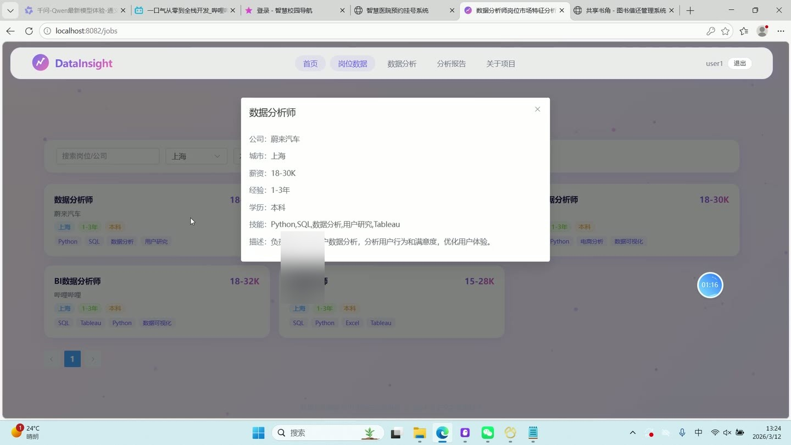
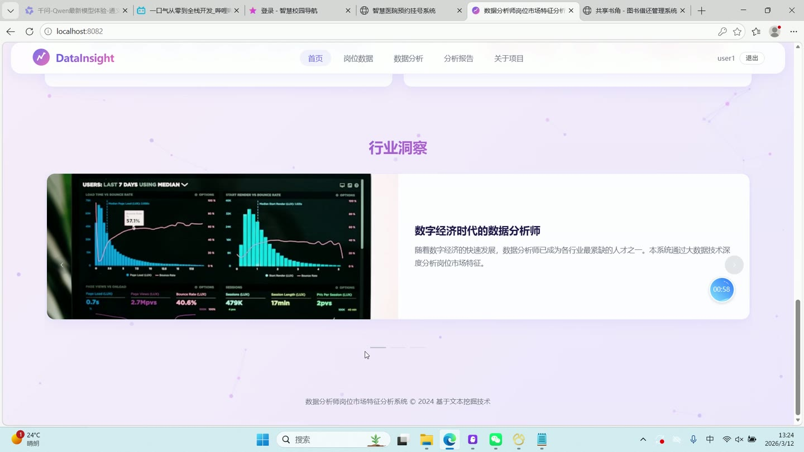
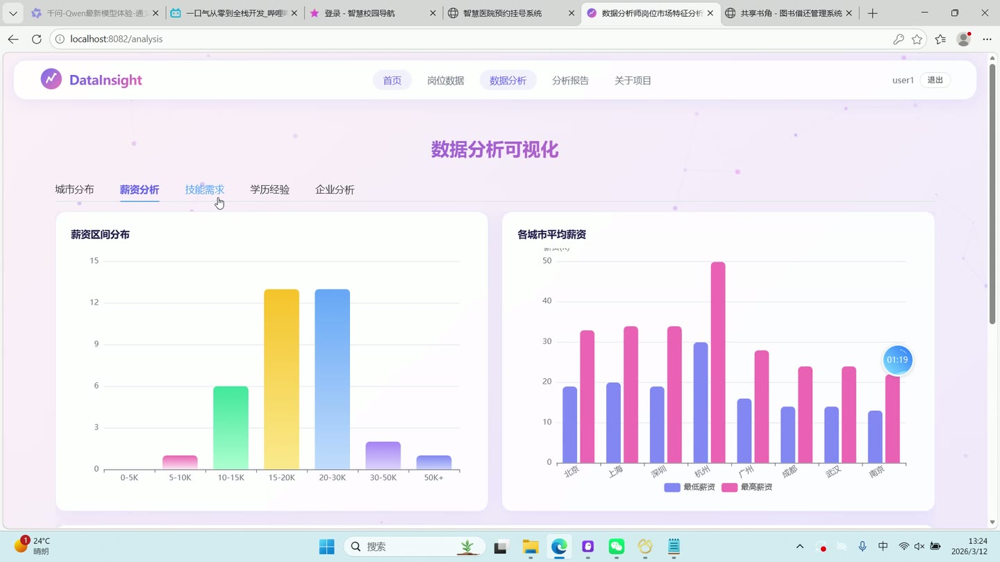
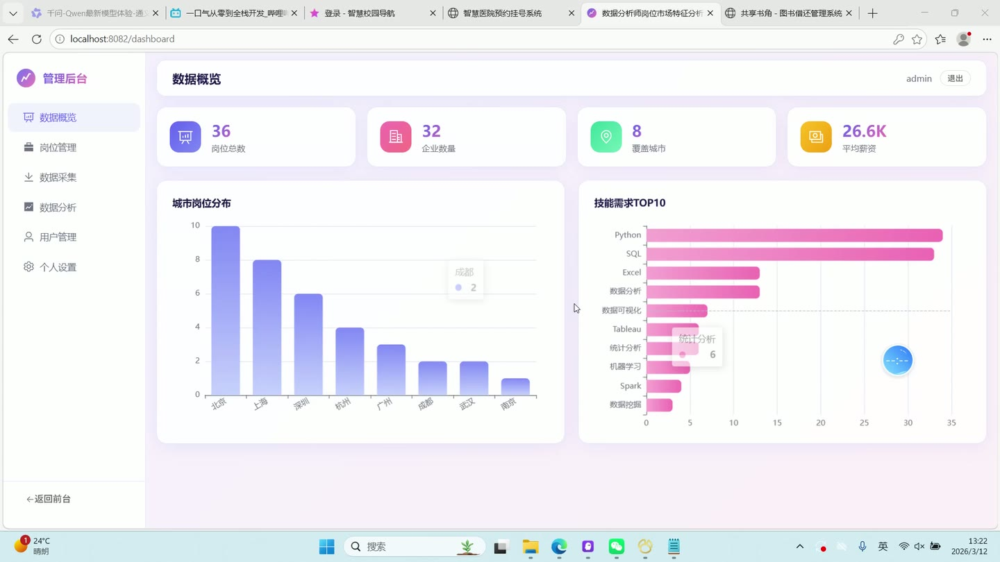
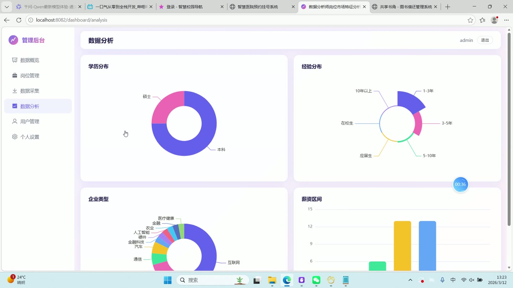
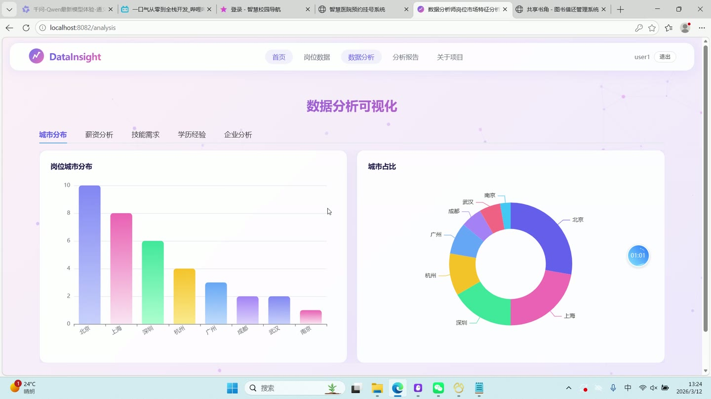

# (附文档)Python+Django+Vue3 基于文本挖掘的数据分析师岗位市场特征分析

**技术栈**：Python、Django、Vue3、MySQL

### 系统简介

本系统是一套基于文本挖掘的数据分析师岗位市场特征分析平台，采用前后端分离架构，后端基于 Django REST Framework 提供接口，前端基于 Vue3 构建单页应用，数据存储于 MySQL。系统包含普通用户端与管理员端两类角色，围绕招聘岗位数据的采集、浏览、统计与可视化分析展开。
 
### 核心功能
 
### 普通用户端

 
- 首页展示：呈现平台标题与说明，并调用仪表盘接口显示岗位数据、覆盖企业、覆盖城市、平均薪资四项统计卡片。 
- 首页图表预览：调用城市分布与薪资分析接口，展示城市岗位分布柱状图与薪资区间分布柱状图。 
- 首页行业洞察轮播：以轮播形式展示行业洞察图文内容，图片加载失败时自动降级为占位图。 
- 岗位列表浏览：以卡片网格展示岗位名称、公司、薪资区间、城市、经验、学历及前四项技能标签。 
- 岗位多条件筛选：支持按岗位/公司关键词、城市、学历、经验下拉条件组合查询岗位数据。 
- 岗位分页浏览：列表按每页 12 条分页，通过分页组件切换页码并重新拉取数据。 
- 岗位详情查看：点击岗位卡片弹出对话框，展示公司、城市、薪资、经验、学历、技能要求与岗位描述。 
- 数据分析可视化：在分析页以标签页切换城市分布、薪资分析、技能需求、学历经验、企业分析五个维度。 
- 城市分布分析：展示岗位城市分布柱状图与城市占比环形饼图，按岗位数量降序取前 15 个城市。 
- 薪资分析：展示薪资区间分布柱状图、各城市平均最低/最高薪资对比图以及学历与薪资关系对比图。 
- 技能需求分析：展示热门技能 TOP20 横向柱状图，并基于岗位描述分词结果展示技能词云。 
- 学历经验分析：以环形饼图展示学历要求分布，以玫瑰图展示经验要求分布。 
- 企业分析：展示企业类型分布饼图、企业规模分布玫瑰图以及招聘岗位最多的企业 TOP15 柱状图。 
- 关于页面：展示研究背景、研究方法说明、技术架构标签，并支持图片上传与预览。 
- 用户注册：填写用户名、邮箱、密码完成注册，注册成功后自动写入令牌与用户信息并跳转首页。 
- 用户登录：填写用户名与密码登录，登录成功后按角色跳转至管理后台或前台首页。
 
### 管理员端

 
- 后台仪表盘：展示岗位总数、企业数量、覆盖城市、平均薪资四项统计卡片。 
- 后台图表：展示城市岗位分布柱状图与技能需求 TOP10 横向柱状图。 
- 岗位管理列表：分页展示岗位名称、公司、城市、薪资区间、经验、学历、来源等字段。 
- 岗位筛选查询：支持按岗位/公司关键词与城市条件筛选岗位列表。 
- 岗位删除：对指定岗位执行删除操作，删除前弹出二次确认提示。 
- 用户管理列表：展示用户 ID、用户名、邮箱、角色、启用状态与注册时间。 
- 用户搜索：支持按用户名关键词检索用户列表。 
- 用户删除：对非管理员账号执行删除操作，管理员账号的删除按钮置灰禁用。 
- 采集任务创建：填写搜索关键词、城市、数据来源与采集页数，提交后异步启动采集任务。 
- 采集来源选择：支持全部来源、51job、智联招聘三种来源选项，采集页数限制在 1 至 10 页。 
- 采集任务记录：以表格展示任务 ID、关键词、城市、来源、状态标签、采集数量、创建时间与错误信息。 
- 分析管理图表：集中展示学历分布、经验分布、企业类型、薪资区间四类图表。 
- 个人信息维护：查看用户名，编辑邮箱、手机号，并上传头像图片保存。
 
### 技术栈

 后端框架Python + Django + Django REST Framework 鉴权方式JWT（PyJWT，HS256 签名，令牌有效期 7 天） 密码存储Django make_password / check_password 哈希校验 数据模型Django ORM（Job、CrawlTask、User、AnalysisReport） 文本挖掘jieba 中文分词 + 自定义停用词表 + 词频统计 前端框架Vue3（组合式 API，script setup） 前端路由Vue Router（createWebHistory，全局前置守卫校验登录与管理员权限） UI 组件库Element Plus 图表库ECharts + echarts-wordcloud 样式方案SCSS + 玻璃拟态卡片样式 数据库MySQL
 
### 交付内容

 
- 后端完整源码 
- 前端完整源码 
- 数据库初始化脚本 
- 万字文档

## 界面展示

---

## 获取完整源码 + 万字文档

本仓库为项目介绍页。**完整前后端源码、数据库初始化脚本、万字项目文档**，请加微信 `kangkangcode`，或访问 [codekk.top](http://codekk.top) 获取。

可作课程设计 / 毕业设计参考，支持远程部署调试。